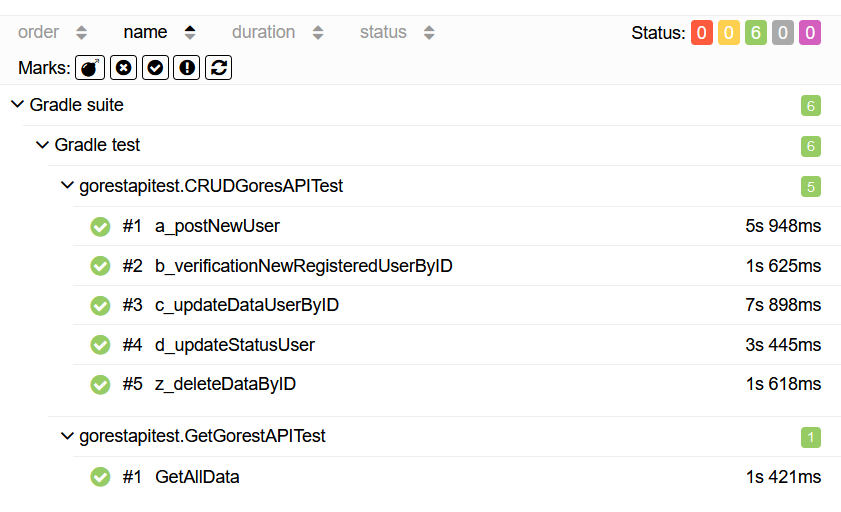

# API Automation Test
### Test API Automation CRUD (Create, Read, Update, Delete)

```
API Testing         : https://gorest.co.in/
Language            : Java
Framework           : TestNG
Library             : Rest Assured
Reporting Library   : Allure
```

Jalankan test via terminal dengan menjalankan gradle command
```
./gradlew clean test
```

Jalankan command untuk __generate allure report__ via terminal
```
allure serve build/allure-results
```

### Allure Results



_Lord Redsky__